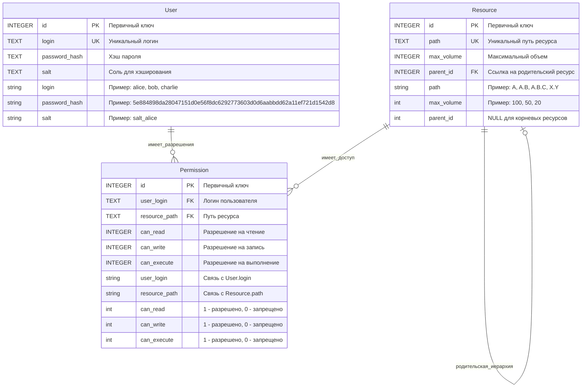

# План имплементации SQL

## Описание сущностей и их атрибутов

### 1. User (Пользователь)
**Атрибуты:**
- `id` (INTEGER) - первичный ключ, автоинкремент
- `login` (TEXT) - уникальный логин пользователя
- `password_hash` (TEXT) - хэш пароля с использованием SHA-256 + соль
- `salt` (TEXT) - соль для хэширования пароля

**Описание:** 
Хранит информацию о пользователях системы. Логин используется для аутентификации, пароль хранится в хэшированном виде с солью для безопасности.

### 2. Resource (Ресурс)
**Атрибуты:**
- `id` (INTEGER) - первичный ключ, автоинкремент
- `path` (TEXT) - уникальный путь ресурса в иерархической структуре
- `max_volume` (INTEGER) - максимальный объем ресурса
- `parent_id` (INTEGER) - внешний ключ на родительский ресурс (может быть NULL)

**Описание:** 
Представляет иерархическую структуру ресурсов. Путь соответствует формату "A.B.C.D", где каждая часть - имя ресурса. Родительские связи определяют наследование прав доступа.

### 3. Permission (Разрешение)
**Атрибуты:**
- `id` (INTEGER) - первичный ключ, автоинкремент
- `user_login` (TEXT) - внешний ключ на логин пользователя
- `resource_path` (TEXT) - внешний ключ на путь ресурса
- `can_read` (INTEGER) - флаг разрешения на чтение (0/1)
- `can_write` (INTEGER) - флаг разрешения на запись (0/1)
- `can_execute` (INTEGER) - флаг разрешения на выполнение (0/1)

**Описание:** 
Определяет права доступа пользователей к ресурсам. Права наследуются от родительских ресурсов к дочерним.

## ER-диаграмма базы данных

